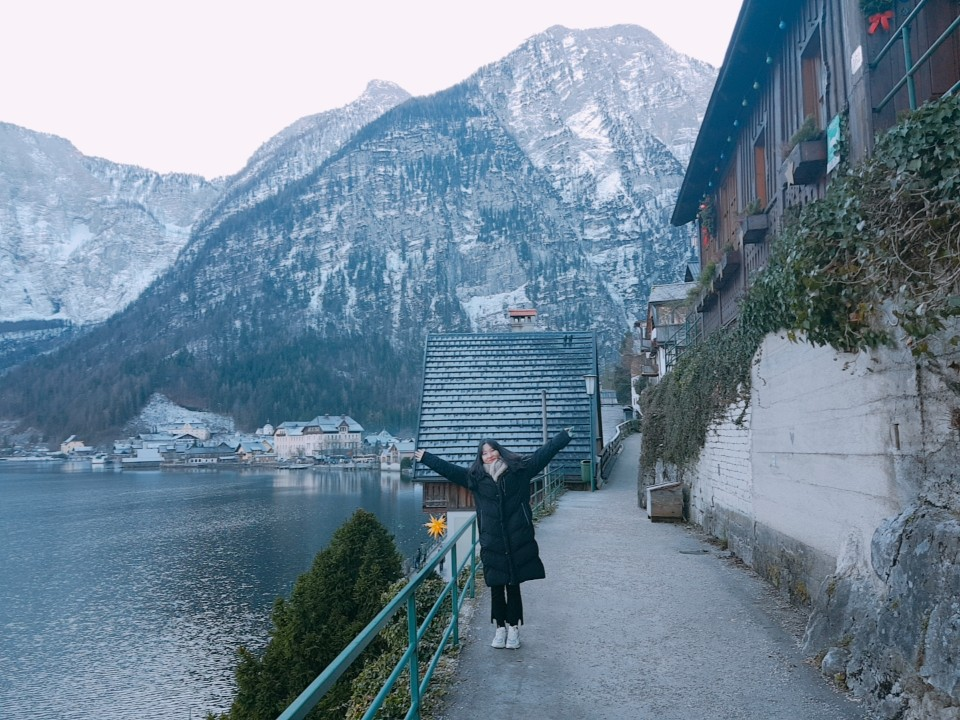

## 2021년
>**2021.01 ~** 　한양대학교 ERICA 알고리즘 학회 0&1 회장
>
>**2021.01 ~**　 한양대학교 ERICA 자작자동차 학회 FOURTOR 자율주행 팀장
>
>**2021.01 - 2021.04**　 자율주행을 위한 차선인식 스터디
>
>**2021.01 - 2021.03** 　[인공지능 스터디 진행](https://www.notion.so/mksmk/87d51cf9c5b749ed92459fa8cec47cdd)
>
>**2021.01 - 2021.02**　 [부동산 매물 관리 시스템](https://manage-realestate.herokuapp.com/main)  
>
>**2021.03 - 2021.05**　 0&1 알고리즘 스터디 멘토
>
>**2021.04 ~**　 한양대학교 ERICA 인공지능 학회 AIM 학술부장
>
>**2021.05 ~**　 AIM 딥러닝 기초 스터디 멘토
>
>**2021.05 ~**　 원곡고등학교 C언어 기초 교육 주강사

## 2020년
>**2020.02 - 2020.12** 　한양대학교 ERICA 알고리즘 학회 0&1 학술부장
>
>**2020.03 - 2020.05**　0&1 자료구조 스터디 멘토
>
>**2020.03 - 2020.05**　0&1 알고리즘 스터디 멘토
>
>**2020.07 - 2020.08**　한양대학교 ERICA 코딩교육 카페 멘토 및 스탭 
>
>**2020.08**
　0&1 C언어 기초 스터디 멘토
>
>**2020.08**
　0&1 알고리즘2 스터디 멘토
>
>**2020.08 - 2020.10**　YoloV3, ROS 스터디 진행 
>
>**2020.09 - 2020.11**　0&1 알고리즘2 스터디 멘토
>
>**2020.12**　0&1 프로그래밍 대회 ZOAC 최우수상

## 2019년
>**2019.03** 　한양대학교ERICA 소프트웨어학부 입학
>
>**2019.05** 　HEPC-Maven 우수상
>
>**2019.07** 　경인지역 6개대학 연합 프로그래밍 경시대회 shake! 21위
>
>**2019.08** 　[Baekjoon Online Judge](https://www.acmicpc.net/) 1000문제 달성
>
>**2019.10** 　ACM-ICPC 본선 진출
>
>**2019.11** 　The 2019 ICPC Asia Seoul Regional Contest 47등
>
>**2019.12** 　ERICA 알고리즘 학회 0&1 프로그래밍 대회 ZOAC 우수상

