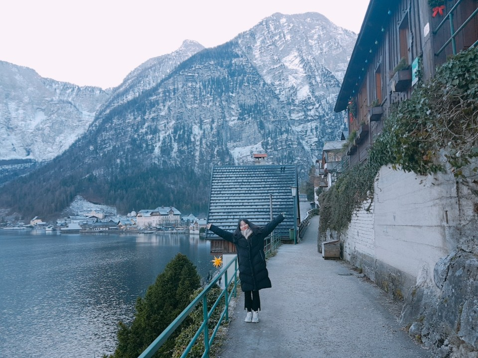

## 2026
> **2026.01 - 2026.02** 　현대자동차그룹 소프티어 부트캠프 7기 [데이터 엔지니어링 코스 수료](https://github.com/softeerbootcamp-7th/DE-Team2-DEng2)

## 2025
> **2025.11** 　[CIKM'25](https://cikm2025.org/) Short Paper Accepted (2저자)
>
> **2025.08** 　한양대학교 대학원 컴퓨터 소프트웨어학과 석사 졸업
>
> **2025.07** 　[KCC 2025](https://www.kiise.or.kr/conference/kcc/2025/) 포스터 발표

## 2024
> **2024.08** 　서울대학교 주최 가속기 프로그래밍 여름학교 고급과정 수료

## 2023년
>**2023.08** 　[한양대학교 BigDasLab](https://bigdas.hanyang.ac.kr/), 그래프 엔진팀 소속
>
>**2023.08** 　한양대학교 대학원 컴퓨터 소프트웨어학과 입학
>
>**2023.06 - 2023.09** 　[0&1 알고리즘 대회 2023 ZOAC 출제](https://www.acmicpc.net/contest/view/1124)
>
>**2023.01 - 2023.03** 　KAIST InfoLab 겨울학기 학부 인턴십
>
>**2023.02** 　한양대학교 ERICA 소프트웨어학부 컴퓨터전공 졸업
>

## 2022년
>**2022.01 - 2022.12** 　한양대학교 ERICA 알고리즘 학회 0&1 회장
>
>**2022.01 - 2022.02** 　한국전자통신연구원(ETRI) 자율주행 연구실 연구연수생
>
>**2022.03 - 2022.06** 　0&1 알고리즘 스터디 멘토
>
>**2022.03 - 2022.06** 　0&1 자료구조 스터디 멘토
>
>**2022.07 - 2022.08** 　한국전자통신연구원(ETRI) 자율주행 연구실 연구연수생
>
>**2022.09 - 2022.12** 　[0&1 알고리즘 대회 2022 ZOAC 출제 및 운영위원장](https://www.acmicpc.net/contest/view/921)
>

## 2021년
>**2021.01 - 2021.12** 　한양대학교 ERICA 알고리즘 학회 0&1 회장
>
>**2021.01 - 2021.12**　 한양대학교 ERICA 자작자동차 학회 FOURTOR 자율주행 팀장
>
>**2021.01 - 2021.04**　 자율주행을 위한 차선인식 스터디
>
>**2021.01 - 2021.03** 　[인공지능 스터디 진행](https://mksmk.notion.site/bcfc89d8a7214b4eb62ff3241a2f5cdd)
>
>**2021.03 - 2021.05**　 0&1 알고리즘 스터디 멘토
>
>**2021.04 - 2021.07**　 한양대학교 ERICA 인공지능 학회 AIM 학술부장
>
>**2021.05 - 2021.07**　 AIM 딥러닝 기초 스터디 멘토
>
>**2021.05 - 2021.08**　 원곡고등학교 C언어 기초 교육 주강사
>
>**2021.09 - 2021.11**　  0&1 알고리즘 스터디 멘토
>
>**2021.09 - 2021.12**　  [ROS 스터디 진행](https://mksmk.notion.site/ROS-654b052db9bc471196e75f3ae276e3c1)
>
>**2021.09 - 2021.12**　  [0&1 알고리즘 대회 2021 ZOAC 출제](https://www.acmicpc.net/contest/view/735)
>
>**2021.11**　  한양대학교 ERICA SW/ICT 학술제, "자율주행 인지 시스템 구축" 최우수상 수상

## 2020년
>**2020.02 - 2020.12** 　한양대학교 ERICA 알고리즘 학회 0&1 학술부장
>
>**2020.03 - 2020.05**　0&1 자료구조 스터디 멘토
>
>**2020.03 - 2020.05**　0&1 알고리즘 스터디 멘토
>
>**2020.07 - 2020.08**　한양대학교 ERICA 코딩교육 카페 멘토 및 스탭 
>
>**2020.08 - 2020.11**
　0&1 C언어 기초 스터디 멘토
>
>**2020.08 - 2020.11**
　0&1 알고리즘2 스터디 멘토
>
>**2020.09 - 2020.11**　0&1 알고리즘2 스터디 멘토
>
>**2020.12**　0&1 프로그래밍 대회 ZOAC 최우수상

## 2019년
>**2019.03** 　한양대학교ERICA 소프트웨어학부 입학
>
>**2019.05** 　HEPC-Maven 우수상
>
>**2019.07** 　경인지역 6개대학 연합 프로그래밍 경시대회 shake! 21위
>
>**2019.08** 　[Baekjoon Online Judge](https://www.acmicpc.net/user/mksmk606) 1000문제 달성
>
>**2019.10** 　ACM-ICPC 본선 진출
>
>**2019.11** 　The 2019 ICPC Asia Seoul Regional Contest 47등
>
>**2019.12** 　ERICA 알고리즘 학회 0&1 프로그래밍 대회 ZOAC 우수상

