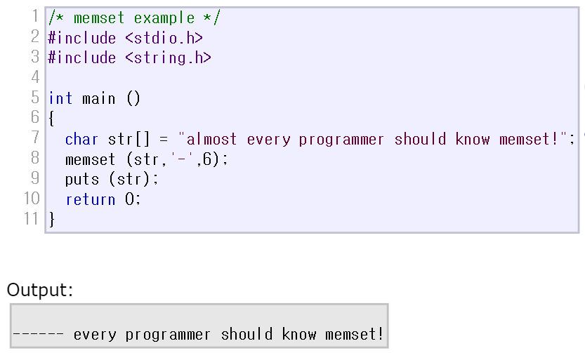

2020.06.30   
___

# memset

<http://www.cplusplus.com/reference/cstring/memset/?kw=memset>


> 

<br>

int형 배열(다차원 배열도 가능)을 0 또는 -1로 초기화할 때, cstring 헤더에 있는 memset 함수를 쓰면 간편합니다!

```c++
#include<cstring>
#include<stdio.h>
int main(){
  int a[4] = {2, 1, 3, 9};
  memset(a, -1, sizeof(a));
  printf("%d %d %d %d", a[0], a[1], a[2], a[3]); // -1 -1 -1 -1 
}
```
<br>

### `주의 사항`

memset 함수는 **오직 0과 -1**로 초기화 할 때만 사용할 수 있는데, 그 이유는 메모리를 **1바이트 단위로 초기화** 시키기 때문입니다.

원래의 memset은 문자열을 초기화 하는 용도로 만들어진 함수이기 때문에 연속된 메모리를 char형 크기(1바이트)씩 분할하여 value(초기화 하려는 값)로 바꿔줍니다.

하지만 int형은 4바이트씩 할당되기 때문에 value값이 4번 반복된 값을 하나로 계산하게 됩니다.

예를 들어, value가 1일 때는 00000001 00000001 00000001 00000001(2) 의 결과 값인 1+2^8+2^16+2^24 = 16,843,009‬으로 초기화됩니다.

따라서 value값이 1바이트 길이를 넘지 않고, 이진수로 나타냈을 때 00000000(2) 또는 11111111(2)이어야만 4번 이어붙였을 때의 결과가 value와 같게 되기 때문에
memset함수는 0 또는 -1로 초기화 할 때만 정상적으로 작동합니다. 