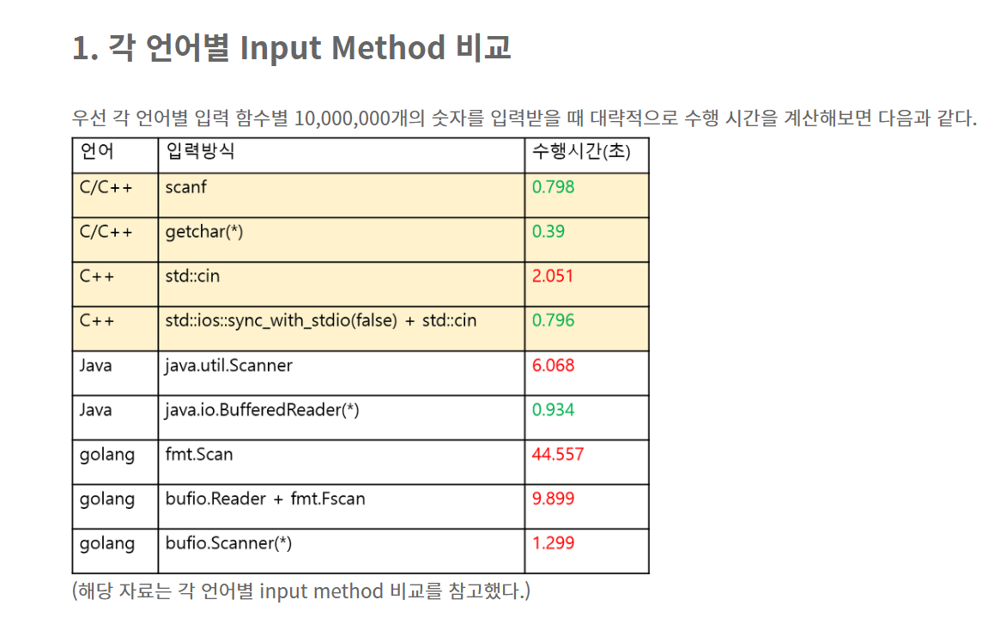

2020.06.29   
____________

# cin, cout

<https://cupjoo.tistory.com/97>

> 

std::cin, std::cout 의 속도는 scanf보다 2배 이상 느립니다.  

scanf, printf 를 썼을 때 맞는 문제를 cin, cout을 쓰면 시간초과 걸리는 경우가 있으니 입력받는 데이터 개수에 유의해 사용해야합니다.  

참고로 cout << endl;은 cout << '\n' 보다 20배 정도 더 느리기 때문에 웬만하면 개행 문자를 쓰는 것이 좋습니다!