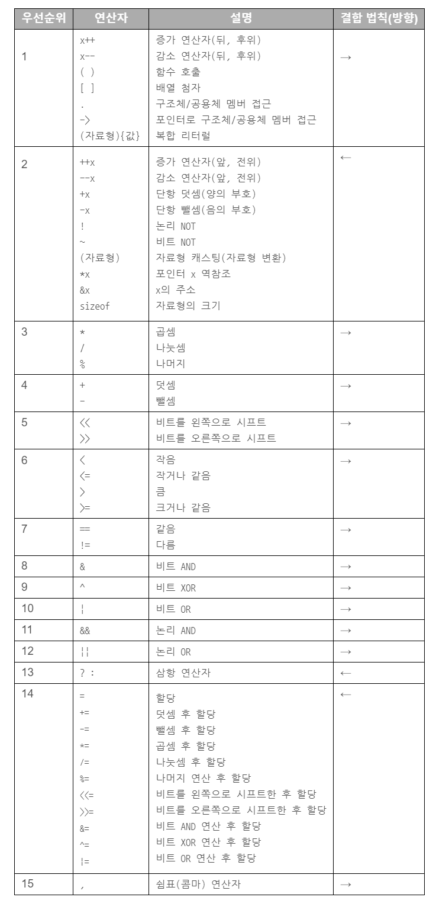

<https://dojang.io/mod/page/view.php?id=188>

> 

<br>

✔ 시프트 연산자 vs 사칙 연산자

비트를 왼쪽 또는 오른쪽으로 한 칸씩 옮기는 시프트 연산자( <<, >> )는 사칙연산자보다 우선순위가 낮습니다!

예를 들어, 3 + (1 << 2) = 7 을 계산하고 싶을 때 괄호를 없애면  ( 3 + 1 << 2 ) = ( 4 << 2 ) = 16 이 되므로 계산 결과가 달라지게 됩니다.

<br>

✔ 비트 연산자 vs 비교 연산자

비트 연산자(&, ^, `|`) 는 사칙연산자, 비교연산자(==, !=, <, >, <=, >=)보다 우선순위가 낮습니다!

예를 들어, (a&b) == c 에서 괄호를 뺀다면 a&(b==c) 를 계산하는 것과 같게 됩니다.

<br>

✔ 논리 NOT 연산자 vs 사칙 연산자

논리 NOT( ! ) 연산자는 사칙연산자보다 우선순위가 높습니다!

예를 들어, a가 짝수인지 알기 위해 if( !a%2 )로 한다면 if( (!a) % 2 )를 하는 것과 같습니다. 
따라서 if( a%2 == 0 ) 혹은 if( !( a%2 ) )로 작성해야 합니다.

<br>

✔ AND 연산자 vs OR 연산자

논리 AND(&&)연산자는 논리 OR(`||`)연산자보다 우선순위가 높습니다.

예를 들어,
```c++
 if(a||b && c||d);
 ```
  는 아래와 같습니다.
  ```c++
  if(a||(b&&c)||d);
  ```
  따라서 우선적으로 처리하고 싶은 부분을 괄호로 묶어 주는 것이 좋습니다.

<br>

연산자 우선순위는 많이 헷갈리는 부분이라 웬만하면 괄호를 쓰는 습관을 가지시는 것을 추천합니다!!!